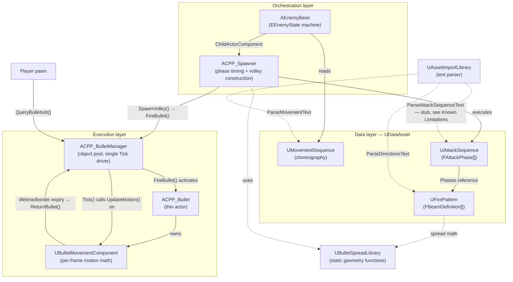
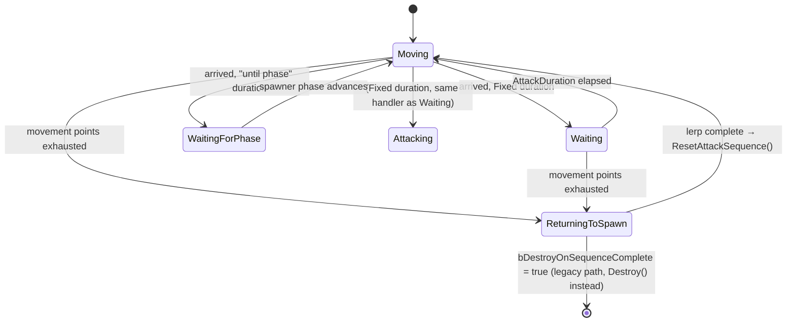

# Bullet Hell Game with Movement in 3 Spatial Dimensions (MMU FYP 2026)

Unreal Engine 5.6 project. Hybrid C++/Blueprint architecture: gameplay-critical
systems (bullet pooling, movement math, pattern geometry, sequencing) live in
C++; visuals, VFX hookups, and per-enemy composition live in Blueprint on top
of the C++ base classes. Genre is a 3D, Touhou-style bullet hell built around
data-driven fire patterns and enemy choreography.

## Architecture at a Glance

Three layers: **data** (DataAssets authored in the editor or via text import),
**orchestration** (spawner and enemy state machine, driven by that data), and
**execution** (the bullet pool, which is the only thing that actually moves
bullets each frame).



## Core Systems

### Bullet Pool and Lifecycle — `ACPP_BulletManager`

Single actor, one per level, responsible for every bullet in flight. Nothing
else spawns or destroys bullet actors at runtime.

**Pool structure.** One `FClassPool` per bullet Blueprint class, each holding
a flat `TArray<FPoolEntry>` (actor pointer + active flag) and a `FreeList` of
free indices. `Pools` maps `UClass* → FClassPool`. A reverse map,
`ActorToEntry`, gives O(1) lookup from a bullet actor back to its pool slot
for `ReturnBullet()`.

- `BeginPlay()` calls `GrowPool()` for every class in `BulletClasses`,
  pre-spawning `PoolSizePerClass` (default 500) instances of each, parked at
  `(0, 0, -100000)`, hidden, and with collision disabled.
- `FireBullet(Class, Location, Direction, Params)` pops an index off that
  class's `FreeList`, places the actor with
  `SetActorLocationAndRotation(..., ETeleportType::TeleportPhysics)` (skips
  sweep and `UpdateOverlaps`), un-hides it, calls
  `Bullet->InitializeBullet(Params)`, and registers the bullet's
  `UBulletMovementComponent` in `ActiveComponents`.
- If a sub-pool is exhausted, it grows by `OverflowGrowBy` (default 64, logs a
  warning) unless `OverflowGrowBy == 0`, in which case the new bullet request
  is silently dropped.
- `ReturnBullet()` hides the actor, disables collision, calls
  `MC->ResetForPool()`, and removes the component from `ActiveComponents`.
  `ReturnAllBullets()` does this for every active bullet (stage clear, player
  death).

**Centralised tick.** `ACPP_BulletManager::Tick()` is the *only* tick driving
bullet motion. It iterates `ActiveComponents` **backward** and calls
`MC->UpdateMotion(DeltaTime)` directly. Iterating backward makes it safe for a
component to remove itself mid-loop: `ReturnBullet()` →
`ActiveComponents.RemoveSingleSwap()` moves the current last element into the
freed slot, and since iteration is already past that point, the swapped-in
entry still gets ticked this frame. `UBulletMovementComponent` itself never
ticks (`PrimaryComponentTick.bCanEverTick = false`) — see 4.2.

**Hit detection.** `QueryBulletsAt(Centre, Radius, OutBullets)` is a plain
O(N) array scan over `ActiveComponents`, comparing squared distance against
`(Radius + BULLET_HIT_RADIUS)²`, where `BULLET_HIT_RADIUS = 8.0f` is a fixed
approximation of the bullet mesh's cross-section (sized for the default cube
mesh at scale `(1.0, 0.16, 0.16)`). This replaced a physics
`OverlapMultiByObjectType` call per bullet, which required every active
bullet to keep `SetActorEnableCollision(true)` and pay a physics body sync on
every move. Bullets never need collision enabled now; the `EnemyBullet` actor
tag set in `GrowPool()` is left in place for other systems (VFX triggers, BP
logic) but is no longer read by `QueryBulletsAt()` itself.

**Setup checklist** (from the header's own setup notes): place one
`ACPP_BulletManager` in the persistent level, fill `BulletClasses` with every
`ACPP_Bullet` subclass in use, route all spawning through
`ACPP_BulletManager::Get(this)->FireBullet(...)`, and disable
`GenerateOverlapEvents` on the bullet's collision box.

### Bullet Actor and Movement — `ACPP_Bullet` / `UBulletMovementComponent`

`ACPP_Bullet` is intentionally thin: a visual, a collision shape, and one
`UBulletMovementComponent`. `PrimaryActorTick.bCanEverTick = false` — the
actor itself never ticks. It exposes two `BlueprintImplementableEvent` hooks,
`OnActivatedFromPool()` / `OnReturnedToPool()`, meant to toggle a Niagara
trail/muzzle component on the Blueprint side (`BP_BulletNew`); without these,
Niagara keeps simulating on every dormant pooled bullet.

`UBulletMovementComponent` holds the actual per-frame motion state and
implements `UpdateMotion_Implementation(DeltaTime)` as a
`BlueprintNativeEvent`, so Blueprint or C++ subclasses can override it for
homing, sine-wave, or orbit behaviour without touching the pool or spawner.

State fields, and why they're split the way they are:

```cpp
FBulletMotionParams MotionParams;   // copy of what Initialize() received
FVector  Velocity        = FVector::ZeroVector;
FVector  CurrentDirection = FVector::ForwardVector;  // unit length, tracked independently
float    CurrentSpeed    = 0.f;                       // cached, avoids Velocity.Size() sqrt
float    ElapsedTime     = 0.f;
```

**The NaN fix.** `CurrentDirection` is deliberately tracked separately from
`Velocity`'s magnitude. The earlier implementation re-derived direction by
normalizing `Velocity` itself; once a decelerating bullet's `CurrentSpeed`
clamped to exactly 0, `Velocity` became the zero vector, and
`GetUnsafeNormal()` on a zero vector computes `0 * InvSqrt(0)` — NaN, since
`GetUnsafeNormal` has no zero-length guard (unlike `GetSafeNormal`). That NaN
then poisoned the bullet's position permanently: NaN comparisons always
evaluate false, so neither the world-border cull nor
`QueryBulletsAt()`'s distance check could ever catch the bullet again,
leaking its pool slot for good. Keeping `CurrentDirection` unit-length and
independent of `CurrentSpeed` means it stays valid even at zero speed.

**Per-frame update** (`UpdateMotion_Implementation`):

1. Lifetime check — if `MotionParams.Lifetime > 0` and elapsed time exceeds
   it, call `ACPP_BulletManager::Get(this)->ReturnBullet(...)` (falls back to
   `Destroy()` only if no manager exists, e.g. PIE without one placed).
2. Speed integration — `CurrentSpeed += LinearAcceleration * DeltaTime`,
   clamped to `[0, MaxSpeed]` when `MaxSpeed > 0`.
3. Direction integration — if `AngularVelocity` is non-zero, rotate
   `CurrentDirection` by `AngularVelocity * DeltaTime` (curves the path
   without changing speed); otherwise direction is held fixed.
4. Position — `NewLocation = CurrentLocation + Velocity * DeltaTime`.
5. World-border cull — bullets outside `|X| > 3000`, `|Y| > 3000`, or
   `|Z| > 2250` (matching the `BP_PlayBoundary` blocking volume) are returned
   to the pool before the position is even applied.
6. Commit — `SetActorLocationAndRotation(..., ETeleportType::TeleportPhysics)`
   in one call, replacing what used to be a separate `SetActorLocation` +
   `SetActorRotation` (each triggering its own `UpdateOverlaps`).

To add a new movement behaviour: subclass `UBulletMovementComponent`,
override `UpdateMotion()`, attach the subclass to a bullet Blueprint instead
of the base component. The pool and spawner never need to know the concrete
type — `Initialize()` is the only contract.

### Fire Pattern Data Model — `UFirePattern`, `FBeamDefinition`

`UFirePattern` (a `UDataAsset`) is one volley's complete geometric
description — the result of one `SpawnVolley()` call. Two layout modes:

**Parametric** (default, `CustomDirections` empty): beams are placed on a
sphere using two independent axes.

- *Azimuth* — `BeamCount` beams spaced `AngleBetweenBeams` degrees apart
  around `SpinAxis`, offset by `OffsetAngle`.
- *Elevation* — `ElevationSteps` rings stacked around
  `DefaultElevationAngle`, `AngleBetweenElevations` degrees apart.
- Total beams = `BeamCount × ElevationSteps`.

**Custom** (`CustomDirections` non-empty): the parametric layout is skipped
entirely; each entry is used as a world-space beam direction directly. Used
for arbitrary geometry, `SpinRate`/`OffsetAngle` still apply as a rigid-body
rotation on top.

**Spin** (`SpinRate`, degrees/second) is accumulated by the spawner
(`AccumSpinAngle`) and applied as the *last* step of beam construction — a
single `FQuat` rotation around `SpinAxis` — so it never disturbs the rest-pose
geometry computed for azimuth/elevation.

**Per-beam overrides** (`FBeamDefinition`, indexed
`elevationStep * BeamCount + azimuthStep` in parametric mode, or by
`CustomDirections` index in custom mode):

- `ElevationOffset` — additional per-beam tilt.
- `SpreadMode` (`Rim` / `Filled` / `Cross` / `Custom`), `BulletsPerBeam`,
  `ConeHalfAngle`, `ConeRollOffset` — how many bullets fire per beam and how
  they fan out. See 4.4 for the geometry.
- `CustomSpreadDirections` — used only when `SpreadMode == Custom`.
- `SpacingBetweenBullets` — staggers spawn position outward along the beam.
- `BulletClassOverride`, `bOverrideMotionParams` / `MotionParamsOverride` —
  per-beam resolution, see the fallback chain in 4.5.

`FBulletMotionParams` is the plain-data struct handed to
`UBulletMovementComponent::Initialize()`: `InitialSpeed`,
`LinearAcceleration`, `MaxSpeed`, `AngularVelocity` (curving), `Lifetime`.

Local frame convention, used consistently across `FBeamDefinition`,
`ESpreadMode`, and `UBulletSpreadLibrary`:

```
X = forward (along beam axis)   — (1,0,0) = no deflection
Y = cone right (⊥ to beam)
Z = cone up    (⊥ to beam and right)

worldDir = BeamDir·local.X + ConeRight·local.Y + ConeUp·local.Z
```

### Attack Sequencing — `UAttackSequence`, `ACPP_Spawner`

`UAttackSequence` is an ordered `TArray<FAttackPhase>`. Each `FAttackPhase`
binds one `UFirePattern` to timing:

| Field | Meaning |
|---|---|
| `Pattern` | which `UFirePattern` fires during this phase |
| `Interval` | seconds between volleys (min 0.01) |
| `ShotCount` | volleys before advancing; `-1` = infinite (pair with `bLoop`) |
| `StartDelay` | seconds to wait, measured from the previous phase ending, before this phase's first volley |
| `bLoop` | phase repeats forever instead of advancing (ShotCount still applies per iteration) |
| `bFacePlayerOnZ` | reorient the pattern's Z axis toward the player at fire time (below) |

`ACPP_Spawner` is the runtime executor and the only entry point into the
bullet system — it holds no pattern data itself, only a `Sequence` reference
and an optional `DefaultBulletClass` fallback.

**Tick loop.** `PhaseTimer` starts at `-StartDelay` and counts up; while it's
negative, nothing fires. Once non-negative, a `while (PhaseTimer >=
Phase.Interval)` loop fires as many volleys as the elapsed time covers (so a
frame hitch that crosses multiple intervals doesn't lose shots), decrementing
`PhaseTimer` by `Interval` each iteration. Spin accumulates
(`AccumSpinAngle += Pattern->SpinRate * DeltaTime`) even during the start
delay, so the pattern is already at the correct angle when firing begins.
When `ShotsThisPhase` reaches `ShotCount`, the phase either resets its
counter (`bLoop`) or calls `AdvancePhase()`, which resets phase state and
fires `OnPhaseStarted(int32)` — or `OnSequenceFinished()` once phases are
exhausted (never called if the final phase loops).

**`SpawnVolley(Pattern)`** — constructs `BeamDirs` per 4.3 (custom vs.
parametric + spin), then for each beam:

1. Resolve `BulletClass` and `MotionParams` via the override chain: beam
   override → pattern default → spawner's `DefaultBulletClass` (bullet class
   only; motion params have no spawner-level fallback).
2. Build the cone-local frame: `ConeRight = BeamDir × WorldUp` (falls back to
   `BeamDir × WorldForward` if nearly parallel to avoid a zero cross
   product), `ConeUp = BeamDir × ConeRight`.
3. Resolve the spread direction array — `CustomSpreadDirections` for
   `ESpreadMode::Custom`, otherwise `UBulletSpreadLibrary::GenerateSpread()`.
4. For each spread direction, transform local → world
   (`BeamDir·X + ConeRight·Y + ConeUp·Z`), stagger the spawn position by
   `SpacingBetweenBullets`, and either draw a debug line
   (`bDebugDrawOnly`) or call `Manager->FireBullet(...)`.

**`bFacePlayerOnZ`.** When set, after `BeamDirs` is built, every direction's
Z component is replaced so the pattern's local "up" axis points at the
player: a frame is built from `ToPlayer` (spawner → player, normalised) and
two perpendiculars (`PatternX = Up × ToPlayer`, `PatternY = ToPlayer ×
PatternX`, both negated to correct a 180° flip while preserving a
right-handed basis), then every beam direction is rotated into that frame.
This preserves the pattern's core XY geometry while aiming it vertically —
noted in source as the workaround for a UE5 engine bug that prevents
combining pattern rotation with direct fire-at-player.

**Runtime control API:** `SetSequence()` (swap + restart from phase 0),
`SetPaused()`, `SkipToNextPhase()` / `SkipToPhase(index)` (reset phase timer,
shot counter, spin angle), `WaitForPhaseCompletion()` /
`IsWaitingForPhaseCompletion()` / `IsCurrentPhaseComplete()` — the
synchronisation primitives `AEnemyBase` uses to align movement with attack
phases (4.6). `OnPhaseStarted` / `OnSequenceFinished` are
`BlueprintNativeEvent`s for sound/animation hooks without touching C++.

### Enemy State Machine — `AEnemyBase`



`AEnemyBase` owns an `ACPP_Spawner` through a `UChildActorComponent`
(`SpawnerComponent`) and a `UMovementSequence` reference, and drives both
from a small state machine (`EEnemyState`: `Moving`, `Attacking`, `Waiting`,
`WaitingForPhase`, `ReturningToSpawn`). Note: the `Attacking` case in `Tick()`
calls the same `UpdateWaiting()` handler as `Waiting` — they're functionally
identical states, kept as separate enum values for readability at call sites.

**Origins.** `SpawnOrigin` is set once in `BeginPlay()` from the actor's
initial location and never changes. `CurrentOrigin` starts equal to it but
can be re-anchored at runtime by a `setorigin` movement command — every
subsequent `Origin`-relative waypoint is computed from
`CurrentOrigin + Point.Location` (see `ComputeTarget()`, 4.7).

**Movement/attack synchronisation.** On arrival at a waypoint,
`ResumeAttackSequence()` unpauses the spawner, and the enemy enters either
`Waiting` (fixed-duration `AttackDuration`) or `WaitingForPhase`
(`EAttackDurationType::UntilPhase`). `WaitingForPhase` registers interest via
`Spawner->WaitForPhaseCompletion()` on its first tick
(`bPhaseWaitRegistered`), then polls `Spawner->IsWaitingForPhaseCompletion()`
each subsequent tick — `ACPP_Spawner::AdvancePhase()` clears that flag when
the phase actually finishes, which is the signal to move on. Whether the
*next* movement command pauses or resumes the attack while moving is decided
by peeking at that command's `bAttackWhileMoving` flag before the state
transition, not re-evaluated every frame.

**Sequence completion.** When `CurrentPoint` runs past the end of
`MovementSequence->MovementPoints`, `HandleSequenceComplete()` fires. If
`bDestroyOnSequenceComplete` is true, this is the legacy behaviour: the enemy
is destroyed immediately. By default (false), the enemy instead pauses
attacking and enters `ReturningToSpawn`, which linearly interpolates from the
position at completion back to `SpawnOrigin` over `ReturnToSpawnDuration`
seconds (default 5s). On arrival, `ResetAttackSequence()` resets
`CurrentPoint`, `CurrentOrigin`, and calls `Spawner->SetSequence(Spawner->
Sequence)` (re-running `StartSequence()`, which resets phase index, shot
count, spin angle, and phase timer), then re-enters `Moving` — the enemy
loops its full choreography indefinitely rather than despawning.

### Movement Choreography DSL — `UMovementSequence`

`UMovementSequence` (a `UDataAsset`) holds a parsed `TArray<FMovementPoint>`.
Four reference frames, selected per point via `EMovementReference`:

| Command | Target computed as |
|---|---|
| `Origin` | `CurrentOrigin + Location` |
| `Move` | `GetActorLocation() + Location` (delta from current position) |
| `Absolute` | `Location` (world coordinate) |
| — | `SetOrigin`: sets `CurrentOrigin = GetActorLocation()`, no movement |

Plus `EMovementCommand::Wait` (stay in place, attack continues) and `::Skip`
(force the spawner to its next phase immediately, then advance to the next
movement point).

**Text format**, parsed by `UAssetImportLibrary::ParseMovementText` (case
insensitive, `#` comments, blank lines ignored, per-line error reporting with
line numbers):

```
origin   X Y Z  AttackDuration|phase  Parallel
move     X Y Z  AttackDuration|phase  Parallel
absolute X Y Z  AttackDuration|phase  Parallel
wait     AttackDuration|phase
setorigin
skip
```

`AttackDuration` is a float in seconds, or the literal word `phase` to wait
until the current attack phase completes instead of a fixed time.
`Parallel` is `0` (pause attack while moving to this point) or `1` (keep
firing while moving). Paste into the DataAsset's `ImportText` field and call
`Rebuild()` (`CallInEditor`) to populate `MovementPoints`; `Clear()` empties
both.

Full syntax reference, worked examples (square patrols, figure-eights,
re-anchored multi-phase choreography, programmatic point generation), and a
troubleshooting guide live in the project's
`enemy-movement-choreography` skill — this section summarises the format as
implemented; that document covers composition patterns in depth.

### Text Import System — `UAssetImportLibrary`

A `UBlueprintFunctionLibrary` providing three plain-text parsers, designed
(per the header) to be version-control-friendly, pastable from spreadsheets,
and LLM-generatable:

1. **`ParseMovementText`** → `TArray<FMovementPoint>`. Fully implemented; see
   4.7.
2. **`ParseDirectionsText`** → `TArray<FVector>`, format `X Y Z` per line
   (normalised at parse time). Feeds `UFirePattern.CustomDirections` via its
   own `ImportText`/`Rebuild()` pair. Fully implemented.
3. **`ParseAttackSequenceText`** → `TArray<FAttackPhase>`, format:
   ```
   phase
   pattern <PatternName>
   interval <float>
   shots <int>
   startdelay <float>   # optional, default 0
   loop                 # optional, default false
   ```
   **Not fully wired up** — see [Known Limitations](#known-limitations).

All three share a tokenizer (whitespace-splitting, `#` comment stripping) and
numeric validators (`StringToFloat`/`StringToInt`) that report the offending
line number on failure.

## Performance Architecture

Several changes in this codebase exist specifically to reduce per-bullet
overhead at scale, documented in source comments and consistent with the
project's performance history:

- **One tick instead of N.** `UBulletMovementComponent` never registers its
  own tick (`bCanEverTick = false`); `ACPP_BulletManager::Tick()` calls
  `UpdateMotion()` on every active component from a single `Actor` tick.
  Removes per-bullet tick-graph registration and prerequisite-sorting
  overhead at scale.
- **Distance queries instead of physics overlaps.** `QueryBulletsAt()` is an
  O(N) array scan comparing squared distance, not a physics
  `OverlapMultiByObjectType`. Active bullets never need
  `SetActorEnableCollision(true)`, removing a `Phys SetBodyTransform` sync on
  every bullet move.
- **`TeleportPhysics` transform updates.** Every bullet position/rotation
  commit uses `ETeleportType::TeleportPhysics`, which skips `UpdateOverlaps`
  entirely — collapses what used to be two transform updates (location, then
  rotation) each triggering overlap resolution into one that triggers none.
- **Object pooling.** No `SpawnActor`/`Destroy` calls at runtime after pool
  warm-up in `BeginPlay()`. Pool growth (`OverflowGrowBy`) is a fallback path
  intended to be tuned so it never fires in normal play.
- **Lumen disabled** (`r.DynamicGlobalIlluminationMethod=0` and related
  `r.Lumen.*` settings in `Config/DefaultEngine.ini`) for packaged-build
  frame rate, at the cost of dynamic GI.
- **Physics property access deferred to `BeginPlay`.** Both `AsteroidActor`
  and (per project history) other actors avoid touching `BodyInstance` /
  calling `SetMassScale` in constructors, since that path executes during CDO
  construction before `GEngine` exists and causes UE5 packaging failures.
